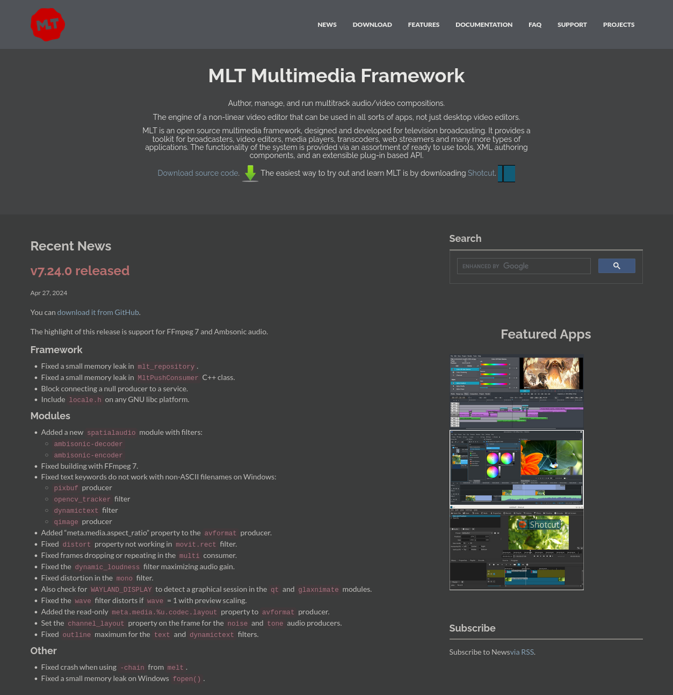
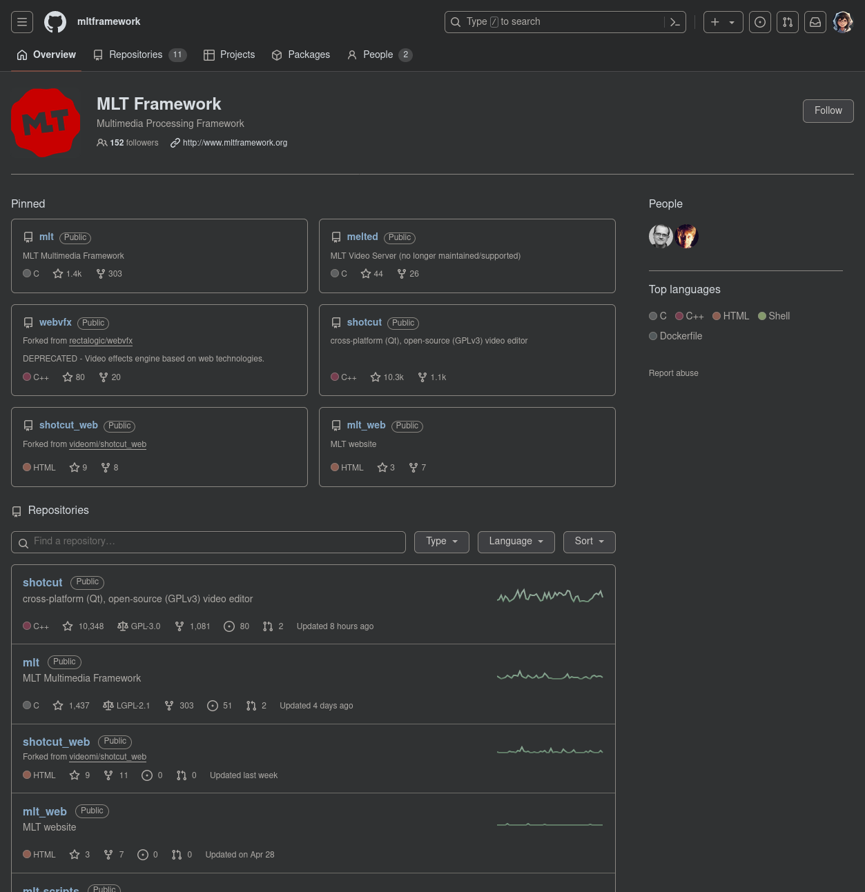

# `MLTマルチメディアフレームワーク`と`Python`
## はじめに
`Shotcut`, `kdenlive`や`OpenShot`では背後に`MLTマルチメディアフレームワーク`が使われています。
この記事では`MLTマルチメディアフレームワークについての簡単な紹介と、その仕組みを通じてエフェクトの自動化を試みます。

参考：
- [MLT Multimedia Framework](https://www.mltframework.org/)
  
- [MLT Framework(GitHub)](https://github.com/mltframework)
  

## MLTマルチメディアフレームワークとはなにか？
MLTフレームワークは、動画編集およびメディア処理のためのオープンソースフレームワークです。
動画編集ソフトウェアのバックエンドとして使用され、多様なメディアファイルの処理、エフェクトの適用、トランジションの追加、オーディオ処理などを行います。
`Kdenlive`や`Shotcut`は、MLTフレームワークを使用する代表的な動画編集ソフトウェアです。

MLTエンジン、MLTサービス、MLTプロデューサー、MLTコンシューマーなどのようなコンポーネントから構成されています。
以下に、MLTフレームワークの説明を表形式に変換しました。

| コンポーネント       | 説明                                                                 |
|----------------------|----------------------------------------------------------------------|
| MLTエンジン          | メディア処理のコアとなるエンジンで、メディアファイルの読み込み、エフェクトの適用、トランジションの処理を行います。 |
| MLTサービス          | 各種エフェクトやフィルタを提供するプラグイン形式のサービス。`frei0r`、`movit`、`sox`など、多様なプラグインを利用できます。 |
| MLTプロデューサー    | メディアファイルを読み込み、タイムライン上で再生するためのコンポーネント。                              |
| MLTコンシューマー    | レンダリング結果を出力するためのコンポーネント。ファイルに保存したり、リアルタイムプレビューを表示したりします。  |

他の関連情報も表形式にまとめてみました。

### MLT、GStreamer、FFmpegの関係

| 技術       | 説明                                                                                                  |
|------------|-------------------------------------------------------------------------------------------------------|
| MLT        | 非線形ビデオ編集エンジン。複数のオーディオおよびビデオトラックを管理し、エフェクトやトランジションを適用。           |
| GStreamer  | マルチメディアフレームワーク。リアルタイム処理やストリーミングに強みがあり、MLTのプラグインとして利用されることがある。 |
| FFmpeg     | マルチメディア処理ライブラリ。エンコード/デコード、フィルタリング、エフェクトの適用においてMLTで広く利用される。      |

### MLTの主な特徴

| 特徴                  | 説明                                                                 |
|-----------------------|----------------------------------------------------------------------|
| モジュール化          | プラグインを通じて機能を拡張できる。                                           |
| クロスプラットフォーム | Linux、Windows、macOSで動作。                                          |
| オープンソース        | ソースコードが公開されており、自由に利用および改良が可能。                         |
| 他のライブラリとの統合 | FFmpegやGStreamerと統合し、広範なメディアフォーマットをサポート。                  |

### MLTを使用しているアプリケーション

| アプリケーション | プラットフォーム                     | 説明                                                                     |
|------------------|----------------------------------|------------------------------------------------------------------------|
| Kdenlive         | Linux, Windows, macOS            | KDEプロジェクトの一部であり、強力な非線形ビデオ編集ソフトウェア。                                    |
| Shotcut          | Linux, Windows, macOS            | クロスプラットフォームのオープンソース動画編集ソフトウェア。                                               |
| Flowblade        | Linux                            | マルチトラック非線形動画編集ソフトウェア。                                                   |
| OpenShot         | Linux, Windows, macOS            | 使いやすさに重点を置いたオープンソース動画編集ソフトウェア。                                           |

### 非線形ビデオ編集エンジンの機能

| 機能              | 説明                                                                                   |
|-------------------|--------------------------------------------------------------------------------------|
| マルチトラック編集 | 複数のビデオおよびオーディオトラックを扱い、タイムライン上で自由に配置して編集できる。                          |
| リアルタイムプレビュー | エフェクトやトランジションをリアルタイムでプレビューしながら編集できる。                                            |
| エフェクトとフィルタ  | 映像や音声に対してさまざまなエフェクトやフィルタを適用できる。                                                 |
| トランジション       | 異なるクリップ間のシームレスな切り替えを提供するトランジション効果をサポート。                                          |
| レンダリング       | 最終的な編集結果をファイルとして出力するためのレンダリング機能を提供。                                              |

この表形式の情報により、MLTの構造や機能、他の技術との関係、および使用しているアプリケーションについての理解が深まることを期待します。
---

MLTフレームワークは、動画編集およびメディア処理のためのオープンソースフレームワークです。主に動画編集ソフトウェアのバックエンドとして使用され、多様なメディアファイルの処理、エフェクトの適用、トランジションの追加、オーディオ処理などを行います。Kdenliveは、MLTフレームワークを使用する代表的な動画編集ソフトウェアの一つです。

### MLTフレームワークの主要な特徴

1. **多機能**: 動画編集、エフェクトの適用、フィルタの追加、トランジションの設定、オーディオ処理など多岐にわたる機能をサポートします。
2. **スクリプト対応**: MLTはXMLスクリプトを使用してプロジェクトの設定を記述することができます。これにより、プログラム的に動画編集を自動化できます。
3. **クロスプラットフォーム**: Linux、Windows、macOSなど、複数のプラットフォームで動作します。
4. **高性能**: 高度なメディア処理機能を提供し、高品質な動画編集をサポートします。
5. **コミュニティサポート**: オープンソースプロジェクトであり、活発な開発者コミュニティによって支えられています。

### MLTフレームワークの主なコンポーネント

1. **MLTエンジン**: メディア処理のコアとなるエンジンで、メディアファイルの読み込み、エフェクトの適用、トランジションの処理を行います。
2. **MLTサービス**: 各種エフェクトやフィルタを提供するプラグイン形式のサービス。`frei0r`、`movit`、`sox`など、多様なプラグインを利用できます。
3. **MLTプロデューサー**: メディアファイルを読み込み、タイムライン上で再生するためのコンポーネント。
4. **MLTコンシューマー**: レンダリング結果を出力するためのコンポーネント。ファイルに保存したり、リアルタイムプレビューを表示したりします。

### MLTフレームワークの使用例

MLTフレームワークを使用して、Pythonから動画編集を行う例を以下に示します。

#### 例: PythonでMLTを使用して動画にエフェクトを追加

まず、`lxml`ライブラリを使用してMLT XMLを生成し、それを使って動画にエフェクトを適用します。

```python
from lxml import etree

def create_mlt_xml_with_effect(input_video, output_xml):
    # MLT XMLのルート要素を作成
    mlt = etree.Element('mlt', version="6.26.1")

    # プロファイルを追加
    profile = etree.SubElement(mlt, 'profile', {
        'description': 'HD 1080p 25 fps',
        'width': '1920',
        'height': '1080',
        'progressive': '1',
        'frame_rate_num': '25',
        'frame_rate_den': '1',
        'colorspace': '709'
    })

    # プロデューサーを追加
    producer = etree.SubElement(mlt, 'producer', id="producer0")
    property_element = etree.SubElement(producer, 'property', name="resource")
    property_element.text = input_video
    property_element = etree.SubElement(producer, 'property', name="mlt_service")
    property_element.text = 'avformat'

    # プレイリストを追加
    playlist = etree.SubElement(mlt, 'playlist', id="playlist0")
    entry = etree.SubElement(playlist, 'entry', producer="producer0")

    # フェードインエフェクトを追加
    filter_element = etree.SubElement(mlt, 'filter', id="filter0", {
        'mlt_service': 'frei0r.alphaatop',
        'in': '0',
        'out': '50'
    })
    param = etree.SubElement(filter_element, 'property', name="0")
    param.text = '0.0=0;1.0=1'

    # タイムラインを追加
    tractor = etree.SubElement(mlt, 'tractor', id="tractor0")
    track = etree.SubElement(tractor, 'track', producer="playlist0")
    transition = etree.SubElement(tractor, 'transition', {
        'mlt_service': 'mix',
        'in': '0',
        'out': '250'
    })

    # XMLツリーをファイルに保存
    tree = etree.ElementTree(mlt)
    tree.write(output_xml, pretty_print=True, xml_declaration=True, encoding='UTF-8')

# 使用例
create_mlt_xml_with_effect("input_video.mp4", "output_with_effect.mlt")
```

このMLT XMLファイルを使用して、MLT対応のツールで動画をレンダリングできます。

MLTフレームワークは、動画編集の柔軟な自動化と高度なメディア処理を可能にする強力なツールです。


---


公式サイトには以下のように書かれています。
つまりMLTは「ノンリニアビデオ編集エンジン」であり、その目的はノンリニアビデオ編集を実現するためのものであり、映像コンテンツを生成するためのフレームワークだと言えます。

> The engine of a non-linear video editor that can be used in all sorts of apps, not just desktop video editors.
MLT is an open source multimedia framework, designed and developed for television broadcasting. It provides a toolkit for broadcasters, video editors, media players, transcoders, web streamers and many more types of applications. The functionality of the system is provided via an assortment of ready to use tools, XML authoring components, and an extensible plug-in based API.

> （翻訳）ノンリニアビデオ編集エンジンは、デスクトップビデオ編集ソフトだけでなく、あらゆる種類のアプリケーションで使用できます。
> MLTはオープンソースのマルチメディアフレームワークで、テレビ放送向けに設計および開発されています。
> ブロードキャスター、ビデオエディタ、メディアプレイヤー、トランスコーダ、ウェブストリーマーなど、多くの種類のアプリケーション向けにツールキットを提供します。
> システムの機能は、すぐに使用できるツールのアソートメント、XMLオーサリングコンポーネント、および拡張可能なプラグインベースのAPIを介して提供されます。

### MLTマルチメディアフレームワークの歴史
以下は`ChatGPT`による解説。
> 1. **2002年 - プロジェクト開始**
>    - MLT (Media Lovin' Toolkit) プロジェクトは、Dan Dennedyによって開始されました。彼は当時、放送業界での使用を目的としたメディア編集フレームワークを開発していました。
> 
> 2. **2003年 - 初期開発とリリース**
>    - 初期バージョンが公開され、基本的なメディア処理機能が実装されました。MLTは、当初からモジュール化されたプラグインアーキテクチャを持ち、さまざまなメディア形式とエフェクトをサポートしました。
> 
> 3. **2005年 - Kdenliveとの統合**
>    - Kdenlive（KDE Non-Linear Video Editor）との統合が進みました。これにより、KdenliveはMLTをバックエンドとして使用することで、より強力な動画編集機能を提供できるようになりました。
> 
> 4. **2007年 - プロジェクトの成長**
>    - MLTは、より多くのエフェクト、トランジション、フィルタをサポートするように成長しました。また、コミュニティの貢献が増え、フレームワークの機能が拡張されました。
> 
> 5. **2010年 - OpenShotとの連携**
>    - OpenShot Video EditorもMLTをバックエンドとして採用しました。これにより、OpenShotも多くのMLTの機能を利用できるようになり、ユーザーに対して強力な動画編集機能を提供できるようになりました。
> 
> 6. **2012年 - MLTの成熟**
>    - MLTは、バージョン0.8をリリースし、安定性とパフォーマンスが大幅に向上しました。また、クロスプラットフォーム対応が強化され、WindowsやmacOSでも利用できるようになりました。
> 
> 7. **2015年 - 新しいエフェクトとフィルタの追加**
>    - コミュニティの継続的な貢献により、新しいエフェクトやフィルタが追加されました。特に、映像とオーディオの処理機能が強化され、プロフェッショナルな編集作業にも対応できるようになりました。
> 
> 8. **2020年 - 現在**
>    - MLTは、引き続き活発に開発されています。最新バージョンでは、より多くのメディア形式のサポート、高度なエフェクト、リアルタイムプレビュー機能などが強化されています。また、KdenliveやShotcutなどの動画編集ソフトウェアのバックエンドとして広く使用されています。

### どのように記述されるか
`MLT XML`として記述します。
このファイルには、プロジェクトの設定、使用するメディアファイル、適用するエフェクトやフィルタ、トラック構成などが記述されます。映像編集のレシピと考えて良さそうです。
#### `MLT XML`の例
```xml
<mlt>
  <!-- ビデオの解像度、フレームレート、カラー空間などの設定を定義 -->
  <profile description="HD 1080p 25 fps" width="1920" height="1080" progressive="1" frame_rate_num="25" frame_rate_den="1" colorspace="709"/>

  <!-- メディアファイルを定義 -->
  <producer id="producer0" in="0" out="250">
    <property name="resource">input_video.mp4</property>
    <property name="mlt_service">avformat</property>
  </producer>
  
  <!-- トラック（プレイリスト）を定義。プロデューサーをトラックに追加。 -->
  <playlist id="playlist0">
    <entry producer="producer0"/>
  </playlist>
  
  <!-- エフェクト（フィルタ）を定義。ここでは、フェードインエフェクトを追加。 -->
  <filter id="filter0" mlt_service="frei0r.alphaatop" in="0" out="50">
    <property name="0">0.0=0;1.0=1</property>
  </filter>
  
  <!-- タイムラインを定義。トラックやトランジションを含む。 -->
  <tractor id="tractor0">
    <track producer="playlist0"/>
    <transition mlt_service="mix" in="0" out="250"/>
  </tractor>
</mlt>
```


